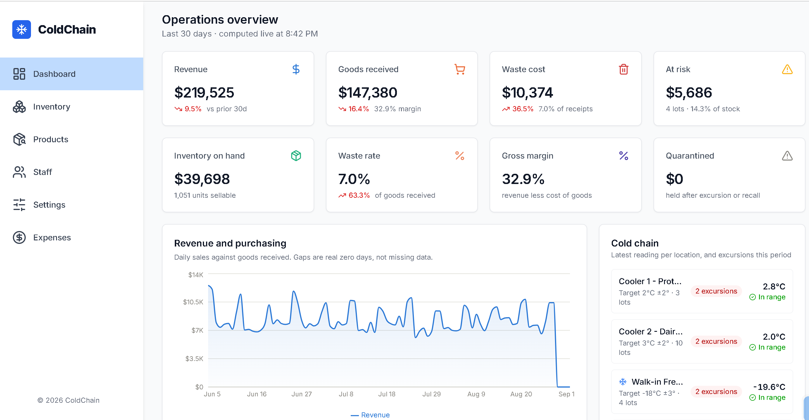

# ColdChain

Lot-level inventory management for perishable and cold-chain goods — expiration
tracking, FEFO allocation, waste analytics, and temperature compliance.

Built for the operational reality that makes perishables hard: you never have
"40 cases of salmon," you have three lots expiring on three different days, and
which one you ship determines whether you make money or throw it away.



---

## Attribution

The project scaffold — the Next.js/Express/Prisma wiring, the sidebar and navbar
shell — comes from **[EdRoh's fullstack inventory management
tutorial](https://github.com/ed-roh/inventory-management)**
([video](https://www.youtube.com/watch?v=ddKQ8sZo_v8)). I started from that
codebase and rebuilt the domain, the data model, the business logic, and the
analytics layer on top of it.

What follows is an honest account of what I changed and why.

---

## What I changed

### The data model is different in kind, not degree

The tutorial tracked stock as `Products.stockQuantity` — a single integer per
product. That is incoherent for perishables, so the schema was rewritten around
a different unit:

| Tutorial | ColdChain |
|---|---|
| `stockQuantity: Int` on the product | `Lot` — a batch with its own expiration date, lot code, cost, and storage location |
| No history; the integer is overwritten | `StockMovement` — an append-only ledger of every receipt, sale, waste event, adjustment, and transfer |
| No suppliers, categories, or locations | `Supplier`, `Category`, `Location` (with temperature zones) |
| No cold-chain concept | `TemperatureReading` with excursion detection and lot quarantine |
| `Users` with name and email only | `User` with hashed password (scrypt) and role |
| `Float` for money | `Decimal(12,2)` — see *Money* below |

A product's on-hand quantity is **derived** by summing its lots, excluding
expired and quarantined stock. Stock you cannot sell is not stock.

### The dashboard was not real

The tutorial shipped `SalesSummary`, `PurchaseSummary`, `ExpenseSummary`, and
`ExpenseByCategory` tables that the seed script filled with pre-computed
totals. The dashboard read those rows directly. Recording a sale changed no
chart, because no chart was computed from anything. Three of the dashboard's
stat cards had their numbers hardcoded as string literals in the JSX.

Those tables are deleted. Every figure is now aggregated live from the ledger:
ten SQL queries running concurrently per request, covering KPIs with
period-over-period change, a gap-free daily trend series, waste by cause, worst
products by waste cost, the expiring-lot action list, a reorder list, cold-chain
status, top sellers, and expense breakdown.

### FEFO allocation

Sales draw stock **First Expired, First Out** — not First In, First Out. The
distinction matters: a lot received later can expire sooner when a supplier
ships short-dated product, and sorting by received date would ship the fresher
carton while the older one rots.

Allocation runs inside a transaction and takes `SELECT ... FOR UPDATE` row
locks. Without them, two concurrent sales both read "10 remaining," both take
10, and the lot lands at −10.

### Verification

Two runnable checks, both exiting non-zero on failure:

- **`npm run verify`** — asserts the system's core invariant (a lot's
  `quantityRemaining` equals the sum of its own movement ledger), plus no
  negative balances, no expired lot still counted as sellable, no orphaned
  movements, and no movement whose quantity sign contradicts its type.
- **`npm run test:fifo`** — 19 assertions covering FEFO ordering across multiple
  lots, refusal to oversell (and that a failed sale writes nothing), exclusion
  of expired and quarantined stock, and bounded waste. Builds its own fixtures
  and deletes them, so it never touches seeded data.

### Money

Currency is `Decimal(12,2)`, never `Float`. Binary floating point cannot
represent `0.1` exactly, so summing thousands of float prices accumulates error
— the first build of this dashboard reported revenue as `255262.20000000027`.

Values stay exact in the database, where all the summing happens, and convert to
`Number` only at the API boundary where they are display data. Temperatures stay
`Float`: they are physical measurements where a fractional degree is meaningless.

### Other fixes carried over from the scaffold

- **`.gitignore` was ignoring `.env/` with a trailing slash** — which matches a
  *directory*, not a file. The real `.env` would have been committed. Fixed, with
  `.env.example` files added.
- **One `PrismaClient` per process** instead of a new one constructed in every
  controller, each opening its own connection pool.
- **Removed `tw-colors`**, a Tailwind plugin that resolved to `undefined` under
  Tailwind's jiti TypeScript config loader and broke the CSS build with an error
  that named `globals.css` and never mentioned the config. Replaced with native
  `dark:` variants.
- **Fixed the dark-mode toggle**, which only ever added classes and never
  removed them, so light mode could not come back once dark was enabled.
- **Removed images hot-linked from the tutorial author's S3 bucket.**

---

## Stack

Next.js 14 · TypeScript · Redux Toolkit Query · Tailwind · Recharts · MUI Data
Grid · Node · Express · Prisma · PostgreSQL

## Running it

```bash
# 1. database
createdb coldchain

# 2. server
cd server
cp .env.example .env          # set DATABASE_URL
npm install
npx prisma migrate dev
npm run seed                  # 120 days of simulated operating history
npm run verify                # confirm the data is internally consistent
npm run dev                   # http://localhost:8000

# 3. client
cd ../client
cp .env.example .env.local
npm install
npm run dev                   # http://localhost:3000
```

Seed login: `admin@coldchain.example` / `ColdChain!2026`

### Scripts

| Command | What it does |
|---|---|
| `npm run seed` | Simulates 120 days of receipts, FEFO sales, waste, and temperature logs |
| `npm run verify` | Data integrity invariants + a live business summary |
| `npm run test:fifo` | 19 assertions against the allocation engine |

## The seed is a simulation, not a fixture

Rather than loading static JSON, the seed walks forward day by day: reorder when
stock runs low, write off anything expired, sell the day's demand FEFO. It
models the mechanisms that actually cause food waste — weekly demand swings,
buyers rounding orders up (running out costs a customer; over-ordering only
costs margin), and roughly one delivery in eight arriving short-dated.

The result lands at a ~5% waste rate against goods received, concentrated in the
shortest-shelf-life products — which is what a real perishables operation looks
like. Every `quantityRemaining` is the arithmetic result of replaying that lot's
own ledger, so the dashboard's aggregates and the individual lot balances cannot
disagree.

## Known gaps

Honest list of what is not done:

- **No authentication flow.** Users have hashed passwords and roles in the
  schema, but there is no login endpoint or session handling yet.
- **No pagination** on the lots and movements endpoints; they cap at a limit
  instead.
- **Next.js 14** — a version upgrade is pending as its own deliberate change.
- **No CI.** `verify` and `test:fifo` exit non-zero and are ready to gate a
  pipeline; the pipeline does not exist yet.
